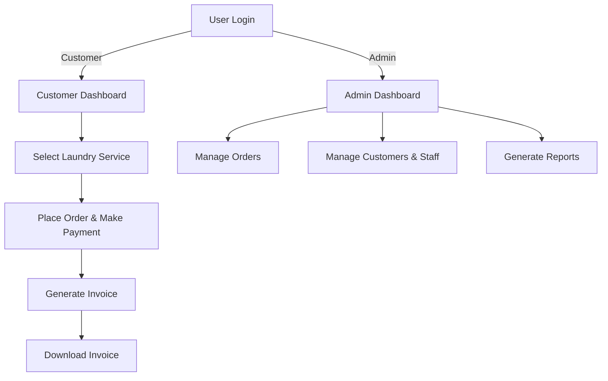

# 🧺 PickUp Laundry - JSP Web Application

## 🌍 Overview

**PickUp Laundry** is a **JSP-based web application** that provides an online laundry service platform. It allows customers to place laundry orders, make online payments, and download invoices. Administrators can manage orders, services, customers, and staff efficiently. The system integrates **Razorpay for payments**, **Captcha for authentication**, and **Web Services for data exchange**.

---

## 👥 Users & Roles

### 👔 **Customers**
- Register and log in securely with CAPTCHA authentication.
- Browse and select laundry services.
- Place orders and make payments via **Razorpay**.
- Download invoices and track order history.

### 🏢 **Administrators**
- Manage **laundry services**, **customers**, and **staff members**.
- View and process **orders and payments**.
- Generate **reports** for business analysis.

---

## 📊 System Workflow Diagram



---

## ⭐ Features

### 🔑 Secure Authentication
- **Role-based login** (Customers & Admins).
- **CAPTCHA authentication** to prevent bots.
- Secure **session management**.

### 🧺 Laundry Service Management
- Customers can browse, select, and **place orders**.
- Admins can **add, update, and delete services**.
- Dynamic pricing based on **weight & fabric type**.

### 💳 Online Payment Integration
- Integrated **Razorpay payment gateway**.
- Secure online **payment processing**.
- Order **status updates** after successful transactions.

### 📜 Invoice & Order History
- Customers receive **auto-generated invoices**.
- **Download invoices as PDFs**.
- Order tracking and history management.

### 📊 Reports & Admin Dashboard
- Generate **monthly revenue reports**.
- View **top services & frequent customers**.
- Real-time **order status tracking**.

---

## 📥 Installation Guide

### Step 1: Clone the Repository
```sh
git clone https://github.com/DarshanScripts/pickup-laundry.git
```

### Step 2: Set Up the Database
1. Open **phpMyAdmin** (or any MySQL database manager).
2. Create a new database (e.g., `pickup_laundry`).
3. Import the provided SQL schema from `WEB-INF/classes/Database/Schema.sql`.
4. Open `DBConnection.class` and update the database credentials:
```java
String url = "jdbc:mysql://localhost:3306/pickup_laundry";
String user = "root";
String password = "";
```

### Step 3: Deploy the Application
1. Open **NetBeans / Eclipse** and load the project.
2. Configure **Tomcat Server** for JSP execution.
3. Run the project and access it at:
   ```sh
   http://localhost:8080/pickup-laundry/
   ```

---

## 📂 Project Structure

```
pickup-laundry/
│── build.xml                        # Apache Ant build configuration
│── web/
│   ├── index.html                    # Main landing page
│   ├── Admin/                        # Admin portal
│   │   ├── Homepage.jsp
│   │   ├── Login.jsp
│   │   ├── Logout.jsp
│   │   ├── Registration.jsp
│   │   ├── Reports.jsp
│   │   ├── ViewOrder.jsp
│   │   ├── validateLogin.jsp
│   │   ├── validateReg.jsp
│   │   ├── ManageCloth/             # Manage clothes categories
│   │   │   ├── AddCloth.jsp
│   │   │   ├── UpdateCloth.jsp
│   │   │   ├── ViewCloth.jsp
│   │   │   ├── valAddCloth.jsp
│   │   │   ├── valDelCloth.jsp
│   │   │   ├── valUpdCloth.jsp
│   │   ├── ManageCustomer/          # Manage customers
│   │   │   ├── UpdateCustomer.jsp
│   │   │   ├── ViewCustomer.jsp
│   │   │   ├── valDelCust.jsp
│   │   │   ├── valUpdCust.jsp
│   │   ├── ManageService/           # Manage laundry services
│   │   │   ├── AddService.jsp
│   │   │   ├── UpdateService.jsp
│   │   │   ├── ViewService.jsp
│   │   │   ├── valAddService.jsp
│   │   │   ├── valDelService.jsp
│   │   │   ├── valUpdService.jsp
│   │   ├── ManageStaff/             # Manage staff accounts
│   │   │   ├── AddStaff.jsp
│   │   │   ├── UpdateStaff.jsp
│   │   │   ├── ViewStaff.jsp
│   │   │   ├── valAddStaff.jsp
│   │   │   ├── valDelStaff.jsp
│   │   │   ├── valUpdStaff.jsp
│   ├── Customer/                    # Customer portal
│   │   ├── ChangePassword.jsp
│   │   ├── ConfirmOrder.jsp
│   │   ├── DownloadPDF.jsp
│   │   ├── Header.jsp
│   │   ├── Homepage.jsp
│   │   ├── Invoice.jsp
```

---

## 💻 Technologies Used
- **JSP & Servlets** – Backend logic and session management.
- **MySQL** – Database for storing orders, payments, and customer details.
- **HTML, CSS, JavaScript** – Frontend UI.
- **AJAX & jQuery** – Real-time order updates.
- **Bootstrap** – Responsive design.
- **Tomcat Server** – Application deployment.
- **Razorpay** – Secure online payment gateway integration.

---

## 📜 License
This project is licensed under the **MIT License**.

---

## 👨‍💻 Author
Developed by **Darshan Shah**. Connect with me:

- **LinkedIn**: [Darshan Shah](https://www.linkedin.com/in/darshan-shah-tech/)
- **Facebook**: [DarshanScripts](https://www.facebook.com/DarshanScripts)
- **GitHub**: [DarshanScripts](https://github.com/DarshanScripts)
- **Quora**: [Darshan Shah](https://www.quora.com/profile/Darshan-Shah-1056)
- **Medium**: [DarshanScripts](https://medium.com/@DarshanScripts)
- **Fiverr**: [DarshanScripts](https://www.fiverr.com/darshanscripts)

